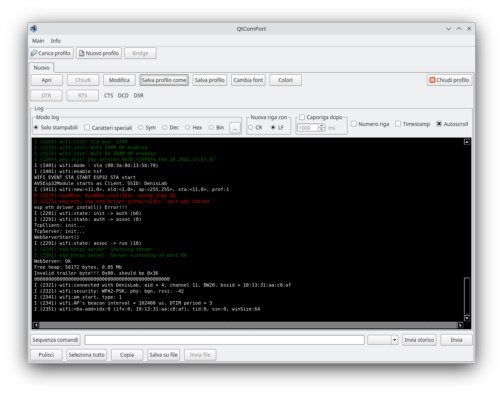

# QtComPort
Written in C++ with Qt framework. It is similar to the old Windows HyperTerminal utility. This software permits to manage more com ports and tcp sockets at the same time. You can put in bridge the com ports and the sockets to monitoring what the serial ports are sending and receiving. It is ideal for doing the reverse engineering of serial device protocols.

## Features

Bridge between RS232 and tcp connections
Bluetooth low energy connections
RS232 connections
TCP client connections
TCP server connections
Commands list (both hex and text), QtComPort can send in loop commands taken from a list
TCP SSL connections

## Commands list

How to see in the above image ist is possible to create a list of commands, as text or hex format, to send. It is possible to setup a delay between commands an to send the commands list in a infinite loop.

## Download QtComPort for Windows and Mac OSX
[https://www.denisgottardello.it/QtComPort/](https://www.denisgottardello.it/QtComPort/)
